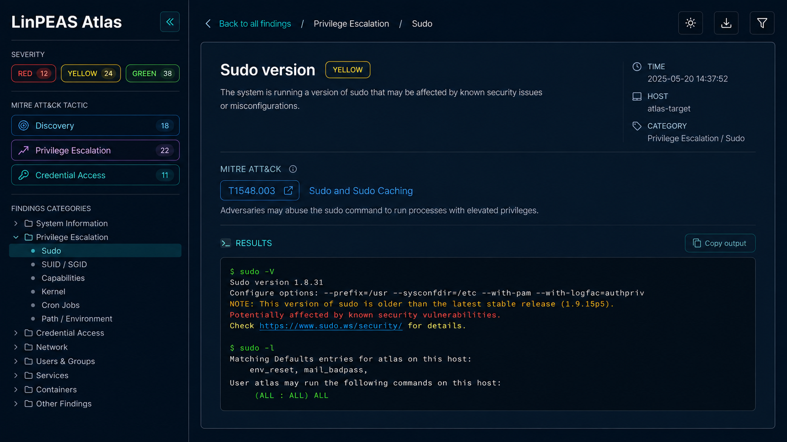

# LinPEAS Atlas

**LinPEAS Atlas** is a portable, local web viewer for [LinPEAS](https://github.com/peass-ng/PEASS-ng) output. It turns a large terminal report into a searchable, structured interface with category navigation, severity filtering, MITRE ATT&CK context, and JSON export.

It uses only the Python standard library. There are no external packages, databases, accounts, or cloud services to configure.

> LinPEAS output can contain usernames, paths, credentials, tokens, and other sensitive host data. Run the viewer locally or protect network access appropriately.

## Interface preview

Representative interface preview showing category navigation, severity controls, ATT&CK tactics, and a selected finding:



## Features

- Parses raw LinPEAS `.txt` and `.log` output into top-level categories and nested sections.
- Opens JSON generated by `peas2json.py` directly.
- Preserves meaningful ANSI colors from LinPEAS output while dropping decorative terminal borders.
- Filters findings by one or more severity colors: `REDYELLOW`, `RED`, `YELLOW`, `GREEN`, `BLUE`, `MAGENTA`, and `CYAN`.
- Builds a collapsible sidebar tree of categories and sections.
- Filters the visible result to the selected category or section.
- Adds known MITRE ATT&CK Enterprise technique names, official ATT&CK links, and tactic badges.
- Filters sections by MITRE tactics such as `Discovery`, `Privilege Escalation`, and `Credential Access`.
- Searches the currently selected category or section.
- Downloads the current structured result as JSON.
- Keeps uploaded content in process memory only; uploaded files are not written to disk.

## Requirements

- Python 3.9 or later
- A modern browser

No `pip install` step is needed.

## Quick start

Place `result.txt` in the same directory as `server.py`, then start the server.

### Linux, macOS, or Kali

```bash
python3 server.py --port 8080
```

Or use the supplied launcher:

```bash
chmod +x run.sh
./run.sh --port 8080
```

### Windows PowerShell

```powershell
.\run.bat --port 8080
```

If you prefer to call Python directly:

```powershell
py server.py --port 8080
```

Open [http://localhost:8080](http://localhost:8080) after the server starts.

## Viewing a different result

1. Start the server.
2. Select **Upload result file** in the sidebar.
3. Choose a raw LinPEAS `.txt` or `.log` file, or a JSON file created by `peas2json.py`.
4. The viewer replaces the current browser result with the uploaded result.

The original `result.txt` is loaded automatically when the page first opens. Uploading a file does not overwrite it.

## How to use the interface

### Browse categories and sections

The sidebar lists top-level LinPEAS categories. Click a category name to open its section list and focus the main panel on that category. Click it again to collapse the list. Selecting a child section filters the main panel to that section and automatically closes other category lists.

The sidebar intentionally omits ATT&CK IDs to keep section names compact. ATT&CK details remain visible in the main content area.

### Search

Use **Search this category** to filter result lines in the selected category or section. Sidebar entries that do not contain the search text are hidden as well.

### Filter by LinPEAS color

The color controls filter lines using the ANSI colors originally emitted by LinPEAS. Select multiple colors to match any selected color. Select **ALL** to clear the color filter.

| Color | Typical LinPEAS meaning |
| --- | --- |
| `REDYELLOW` | High-confidence privilege-escalation vector |
| `RED` | Important item to review |
| `YELLOW` | Warning or potentially relevant result |
| `GREEN` | Common discovery information |

The viewer displays the original text coloring, but does not add repetitive color labels to every line.

### Filter by MITRE ATT&CK tactic

Sections containing known ATT&CK technique IDs receive tactic badges. Select one or more tactic controls to retain matching sections. For example, selecting **Privilege Escalation** highlights sections tagged with techniques such as `T1068` or `T1548.003`.

Technique identifiers in the main panel include their known ATT&CK technique name and link directly to the official MITRE ATT&CK page. The built-in mapping is local, so basic ATT&CK labels remain available without an internet connection; internet access is only needed when opening the official links.

## Command-line options

```text
python3 server.py [--host HOST] [--port PORT]
```

| Option | Default | Description |
| --- | --- | --- |
| `--host` | `0.0.0.0` | Address on which the viewer listens. Use `127.0.0.1` to accept local connections only. |
| `--port` | `8080` | TCP port for the web interface. |

Examples:

```bash
# Local-only viewer
python3 server.py --host 127.0.0.1 --port 8080

# Use a different port
python3 server.py --port 9000
```

## Network access and safety

The default host setting makes the viewer reachable from the local network when firewall rules allow it. This is convenient for a lab machine, but LinPEAS reports are sensitive.

- Prefer `--host 127.0.0.1` for a local-only session.
- Use a VPN, SSH tunnel, or authenticated reverse proxy before exposing the viewer beyond a trusted network.
- Do not upload assessment results to an untrusted public instance.
- The viewer does not execute uploaded content. It reads uploaded files as text and converts their report structure to JSON in memory.

## Project layout

```text
.
├── server.py                 # Portable HTTP server, parser, and browser interface
├── peas2json.py              # Original command-line parser
├── result.txt                # Optional default result displayed on startup
├── run.sh                    # Linux/macOS/Kali launcher
├── run.bat                   # Windows launcher
└── docs/images/
    └── linpeas-atlas-ui.png  # README interface preview
```

## Troubleshooting

### PowerShell cannot find `run.bat`

PowerShell does not execute files from the current directory unless the path is explicit:

```powershell
.\run.bat --port 8080
```

### The port is already in use

Use another port:

```powershell
.\run.bat --port 9000
```

Then open [http://localhost:9000](http://localhost:9000).

### No sections appear

Confirm that the uploaded file is a full LinPEAS report and includes the standard box-drawing section headers. Decorative border-only lines are ignored intentionally.

### Stop the server

Press `Ctrl+C` in the terminal that is running the server.

## Notes

LinPEAS Atlas helps review and organize enumeration output. It does not prove exploitability, validate vulnerabilities, or replace manual security analysis. Use LinPEAS and this viewer only on systems you are authorized to assess.

MITRE ATT&CK is a registered trademark of The MITRE Corporation. LinPEAS Atlas is not affiliated with MITRE or the PEASS-ng project.
